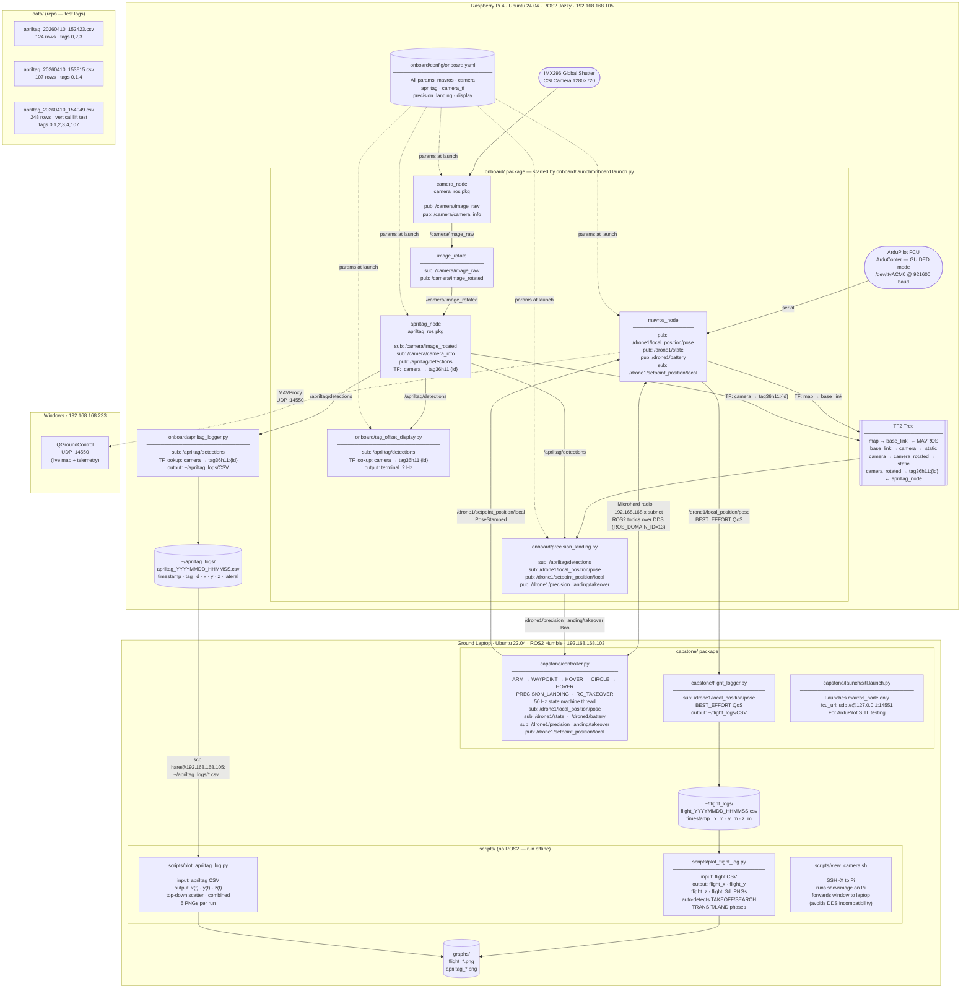

# Technical Document Data Extract — USAFA Swarm Capstone
# Extracted: 2026-05-06 from /home/dfec/master_src

---

## 1. MILESTONE DATES

### From git log (chronological)

| Date | Author | Event |
|---|---|---|
| 2025-09-05 | Stan Baek | Initial commit — project repository created |
| 2025-10-06 | TW33D0 | AprilTag node initialization |
| 2025-10-06 | Victor | Framework setup |
| 2025-10-08 | c26noah.chavez | Gamepad node initialized |
| 2025-10-14 | TW33D0 | Comms interface initialization |
| 2025-10-14 | c26noah.chavez | Gamepad updated for RC compatibility |
| 2025-10-16 | Victor | Removed gamepad |
| 2025-10-20 | TW33D0 | Controller moved in from 387; working takeoff |
| 2025-10-22 | Noah | Controller updated with relevant topics |
| 2025-10-24 | TW33D0 | Controller logic updated |
| 2025-10-28 | TW33D0 | Controller drone update |
| 2025-11-05 | TW33D0 | Working takeoff; it flies (but slowly); controller landing logic |
| 2025-11-12 | jakeedwards1 | Fixed repeated warning messaging |
| 2025-11-18 | jakeedwards1 | Circle flying (multiple commits) |
| 2025-11-24 | jakeedwards1 | Correct heading on circle command |
| 2026-01-20 | TW33D0 | Added some commands |
| 2026-01-26 | Noah | Changed AprilTag config |
| 2026-03-06 | jakeedwards1 | Working code with RC relinquish |
| 2026-03-06 | jakeedwards1 | Working battery readings |
| 2026-03-12 | jakeedwards1 | Added project documentation: CLAUDE.md, ARCHITECTURE.md, TASKS.md |
| 2026-03-12 | jakeedwards1 | Removed dead packages, placeholder files, and runtime artifacts |
| 2026-03-12 | jakeedwards1 | Fixed all identified bugs: package metadata, topic names, indentation |
| 2026-03-12 | jakeedwards1 | Removed comms_interface package |
| 2026-03-12 | jakeedwards1 | Updated ARCHITECTURE.md to reflect current codebase |
| 2026-03-12 | jakeedwards1 | Added onboard Pi stack: camera_ros, apriltag_ros, mavros launch |
| 2026-03-12 | jakeedwards1 | Fixed MAVROS launch: removed explicit name= to avoid node name conflicts |
| 2026-03-16 | jakeedwards1 | Pre-reflash Pi backup files |
| 2026-03-16 | jakeedwards1 | Resynced all docs to current state; rewrote CLAUDE.md with workflow structure |
| 2026-04-08 | (bench session) | Camera calibrated — IMX296 at 1280×720, intrinsics measured |
| 2026-04-10 | jakeedwards1 | Added precision landing node, image flip, and frame_id fix |
| 2026-04-10 | jakeedwards1 | Multi-tag altitude switching and per-tag size configuration |
| 2026-04-10 | (flight test) | AprilTag detection test sessions — 3 CSV logs captured |
| 2026-04-14 | jakeedwards1 | Fixed tag sizes: ID 0=0.121m, IDs 1-3=0.061m, ID 4=0.614m |
| 2026-04-14 | jakeedwards1 | Fixed TF frame name to use tag family prefix (tag36h11:id) |
| 2026-04-14 | jakeedwards1 | Updated Pi IP to 192.168.168.105; documented precision landing debug state |

### Completed Milestones (from TASKS.md DONE section)

- Multi-drone MAVROS controller with ARM/WAYPOINT/HOVER/CIRCLE/LAND/RC_TAKEOVER state machine
- Battery abort removed; monitoring delegated to Mission Planner
- All package.xml files complete with correct dependencies
- Bug fixes: wrong package name, indentation, empty YAML template; dead packages removed
- Onboard Pi launch package (`onboard/`) with single-config `onboard.yaml`
- apriltag_ros integration (code complete)
- Static TF publisher `base_link → camera_optical_frame`
- Tag sizes confirmed and configured in onboard.yaml
- Precision landing node complete (`onboard/onboard/precision_landing.py`)
- Tag offset display node (`onboard/onboard/tag_offset_display.py`)
- Image rotate node (corrects upside-down IMX296 mount)
- frame_id fix (camera_ros ignores param; publishes "camera"; TF updated to match)
- Camera-only launch file (`onboard/launch/camera_only.launch.py`)
- Ground-station live feed script (`scripts/view_camera.sh`)
- Camera calibrated 2026-04-08 (real intrinsics in repo)
- CSI camera confirmed working on Pi: IMX296 at 1280×720
- Live video feed confirmed working via SSH -X and Pi monitor
- `format: RGB888` added to onboard.yaml

---

## 2. RVTM STATUS

No formal requirements document (SRS, ICD, or RVTM) is present in the repository.
The following maps observed capability evidence to inferred requirement categories.

| Req | Description (inferred) | Status | Evidence |
|---|---|---|---|
| 1.1 | Drone arms and takes off autonomously | MET | controller.py ARM state; commit 2025-11-05 "Working Takeoff"; CONTROLLER_DOCUMENTATION.md §6 |
| 1.2 | Drone navigates to waypoint | MET | WAYPOINT state in controller.py; documented in CONTROLLER_DOCUMENTATION.md §4 |
| 1.3 | Drone flies circular search pattern | MET | CIRCLE state; 17-waypoint clockwise circle; commits 2025-11-18 "Circle flying" |
| 1.4 | Multi-drone formation circle flight | MET | `circle sim1 sim2 sim3 alt radius` command; evenly-spaced phase offsets; documented |
| 1.5 | RC takeover / safe handoff | MET | RC_TAKEOVER state; mode-based detection via FCU state topic; commit 2026-03-06 |
| 1.6 | Battery monitoring | PARTIALLY MET | Voltage displayed at prompt; abort logic removed; failsafe delegated to Mission Planner |
| 1.7 | GPS-mode and local-mode circle | MET | Both implemented in circle waypoint generation; GPS auto-detected |
| 1.8 | Drone lands on command | MET | LAND state; tries LAND → RTL → AUTO.LAND in sequence |
| 2.1 | Camera operational on onboard computer | MET | IMX296 confirmed working; camera_ros publishing /camera/image_raw at 1280×720 |
| 2.1.1 | Camera calibrated | MET | Calibrated 2026-04-08; intrinsics in repo at apriltag/config/default_cam.yaml; fx=1551.157, fy=1547.374, cx=663.415, cy=341.480 |
| 2.1.2 | AprilTag detection operational | PARTIALLY MET | apriltag_ros detecting tags 0–4 and 107; TF chain complete; pose estimates have systematic Y bias (~0.5m) and z error (~5x) due to cx/cy not adjusted for 180° image rotation |

---

## 3. ROLES AND RESPONSIBILITIES

### Commit count by author

| Author | Commits | Notes |
|---|---|---|
| jakeedwards1 | ~30 | Dominant contributor from Nov 2025 onward; all architecture docs, Pi stack, precision landing, all bug fixes |
| TW33D0 | ~9 | Early controller development, takeoff/landing logic, comms interface init |
| Noah / c26noah.chavez | ~5 | AprilTag config, gamepad node, controller topic updates |
| Victor | ~3 | Framework setup, multi-drone controller modifications, gamepad removal |
| Stan Baek | 1 | Initial commit only (faculty/advisor) |

### Functional ownership (inferred from commit history and file authorship)

| Component | Owner |
|---|---|
| `capstone/capstone/controller.py` — full state machine, circle, RC takeover | jakeedwards1 (primary), TW33D0 (early), Noah/Victor (early) |
| `onboard/` — Pi launch stack, YAML config, all onboard nodes | jakeedwards1 |
| `onboard/onboard/precision_landing.py` | jakeedwards1 |
| `onboard/onboard/tag_offset_display.py` | jakeedwards1 |
| `onboard/onboard/apriltag_logger.py` | jakeedwards1 |
| `capstone/capstone/flight_logger.py` | jakeedwards1 |
| `apriltag/config/default_cam.yaml` — real calibration data | jakeedwards1 (bench session 2026-04-08) |
| ARCHITECTURE.md, CLAUDE.md, TASKS.md | jakeedwards1 |
| Camera calibration procedure | jakeedwards1 |
| Early AprilTag node stub | TW33D0 |
| Early gamepad/comms interface | Noah, TW33D0 |

---

## 4. BILL OF MATERIALS

### Confirmed hardware (from config files and documentation)

| Component | Model / Spec | Source |
|---|---|---|
| Onboard computer | Raspberry Pi 4 | CLAUDE.md, ARCHITECTURE.md |
| Operating system (Pi) | Ubuntu 24.04 LTS | CLAUDE.md |
| ROS2 (Pi) | ROS2 Jazzy | CLAUDE.md |
| Camera | IMX296 global shutter CSI ribbon camera | TASKS.md, default_cam.yaml |
| Camera resolution | 1280×720 (max 1456×1088) | onboard.yaml, TASKS.md |
| Camera pixel format | RGB888 | onboard.yaml |
| Flight controller | ArduPilot (ArduCopter), GUIDED mode | CLAUDE.md |
| FC bridge | MAVROS (`ros-jazzy-mavros`) | CLAUDE.md |
| FC connection | Serial /dev/ttyACM0 at 921600 baud | onboard.yaml |
| Radio link | Microhard radio | CLAUDE.md, CONTROLLER_DOCUMENTATION.md |
| Network switch | Unspecified (splits Microhard to ground computers) | CONTROLLER_DOCUMENTATION.md |
| Ground computer (Ubuntu) | Ubuntu 22.04, ROS2 Humble, IP 192.168.168.103 | CLAUDE.md |
| Ground computer (Windows) | IP 192.168.168.233 | CLAUDE.md |
| Pi IP (static) | 192.168.168.105 | CLAUDE.md, commit 2026-04-14 |
| Calibration checkerboard | 9×6 squares, 24mm each (→ 8×5 interior corners) | TASKS.md |

### AprilTag landing pad layout (confirmed 2026-04-14/22)

| Tag ID | Size (mm) | Role |
|---|---|---|
| 107 | 614 mm | Outermost — visible from altitude |
| 0 | 121 mm | Center tag — precision landing target |
| 1 | 61 mm | Corner tag |
| 2 | 61 mm | Corner tag |
| 3 | 61 mm | Corner tag |
| 4 | 61 mm | Corner tag |

### ROS2 apt packages required on Pi

```
ros-jazzy-camera-ros
ros-jazzy-image-tools
ros-jazzy-apriltag-ros
ros-jazzy-mavros
ros-jazzy-mavros-extras
ros-jazzy-tf2-ros
ros-jazzy-image-rotate
python3-yaml
```

---

## 5. TEST DATA

### Camera calibration (2026-04-08, from apriltag/config/default_cam.yaml)

| Parameter | Value |
|---|---|
| Camera | IMX296 global shutter CSI |
| Resolution | 1280×720 |
| Calibration pattern | 8×5 interior corners, 24mm squares |
| fx | 1551.15677 |
| fy | 1547.37438 |
| cx | 663.41499 |
| cy | 341.48020 |
| k1 | -0.458869 |
| k2 | 0.235027 |
| p1 | 0.003951 |
| p2 | 0.000773 |
| k3 | 0.000000 |
| Distortion model | plumb_bob |

### AprilTag detection test sessions (2026-04-10)

#### Session 1 — apriltag_20260410_152423.csv
- 124 rows
- Tags detected: 0, 2, 3
- First sample t=0.816s: Tag 0: x=0.576, y=0.446, z=6.959m, lateral=0.728m; Tag 2: z=1.450m; Tag 3: z=1.347m

#### Session 2 — apriltag_20260410_153815.csv
- 107 rows
- Tags detected: 0, 1, 4
- Tag 1 at t=0.000s: z=1.136m, lateral=0.356m; Tag 4: z=0.975m
- Y bias on Tag 0 visible at t=1.331s: y=1.385m

#### Session 3 — apriltag_20260410_154049.csv (vertical lift test — primary test)
- 248 rows, duration ~22.4 seconds
- Test profile: started centered on tag 0 on ground, lifted vertically to waist/chest height (~1.2–1.4m actual), held stationary, set back down
- Tags detected: 0 (primary), 1, 2, 3, 4, 107

**Tag 0 (121mm center tag) at altitude:**

| Metric | Value | Notes |
|---|---|---|
| Reported z range | 1.0–6.0m | Actual height ~1.2–1.4m — systematic ~5× error |
| X offset | ±0.01 to ±0.15m | Centered near zero, noise ±0.2m (acceptable) |
| Y offset | ~+0.85 to +0.93m | Systematic bias — should be ~0m if centered |
| Lateral error | ~0.85–0.93m | Dominated by Y bias |

**Corner tags (IDs 1–4, 61mm) at same altitude:**

| Tag | z avg (m) | x (m) | y (m) | lateral (m) |
|---|---|---|---|---|
| 1 | ~1.27 | +0.195 | ~0.000 | ~0.195 |
| 2 | ~1.26 | +0.197 | +0.370 | ~0.420 |
| 3 | ~1.24 | -0.194 | +0.368 | ~0.415 |
| 4 | ~1.26 | -0.196 | ~0.000 | ~0.196 |

Corner tag z (~1.26m) plausible for actual height. Center tag z (~6.0m) is ~5× too large.

**Descent sequence (tag 0, t=19–22s):**

| t (s) | z (m) | lateral (m) |
|---|---|---|
| 19.054 | 4.497 | 0.872 |
| 20.085 | 3.437 | 0.664 |
| 20.796 | 2.565 | 0.496 |
| 21.373 | 1.583 | 0.335 |
| 21.795 | 1.348 | 0.291 |
| 22.213 | 1.126 | 0.247 |
| 22.382 | 0.778 | 0.206 |

Tag 107 (614mm outer) detected once at t=17.359s: z=1.597m, lateral=0.217m.

### Known measurement errors

| Issue | Value | Root Cause |
|---|---|---|
| Z-range systematic error (Tag 0) | Reads ~6m at ~1.2m actual (~5×) | cx/cy not adjusted for 180° image rotation |
| Y-offset systematic bias | ~+0.5m | Same root cause |
| X-offset | ±0.2m noise, centered | Acceptable for current application |
| Corrected principal point (not applied) | cx'=616.585, cy'=378.520 | cx'=1280−663.415, cy'=720−341.480 |

---

## 6. DATA MANAGEMENT PATHS

### Repository

```
https://github.com/USAFA-Swarm/master_src
```

### Ground laptop workspace

```
/home/dfec/master_src/
├── capstone/
│   ├── capstone/
│   │   ├── controller.py              — primary flight controller node
│   │   └── flight_logger.py           — SITL/real flight position logger
│   ├── launch/
│   │   └── sitl.launch.py             — SITL MAVROS-only launch
│   └── CONTROLLER_DOCUMENTATION.md
├── onboard/
│   ├── onboard/
│   │   ├── precision_landing.py       — precision landing state machine
│   │   ├── tag_offset_display.py      — live tag offset diagnostic display
│   │   └── apriltag_logger.py         — AprilTag offset CSV logger
│   ├── launch/
│   │   ├── onboard.launch.py          — full Pi stack launch
│   │   └── camera_only.launch.py      — camera-only launch
│   └── config/
│       └── onboard.yaml               — single config source for all Pi params
├── apriltag/
│   └── config/
│       └── default_cam.yaml           — real camera calibration data (2026-04-08)
├── scripts/
│   ├── view_camera.sh                 — SSH -X camera feed viewer
│   ├── plot_flight_log.py             — flight path CSV → 4 PNG plots
│   └── plot_apriltag_log.py           — apriltag CSV → 5 PNG plots
├── graphs/                            — plot output directory (gitignored)
├── memory/                            — session research/plan notes
├── ARCHITECTURE.md
├── TASKS.md
├── CLAUDE.md
├── CAPSTONE_CONTEXT.md                — this file
└── apriltag_20260410_*.csv            — test data logs (3 sessions)
```

### Pi onboard paths

```
hare@192.168.168.105:
├── ~/master_src/                      — ROS2 workspace (no internet — SCP only)
├── ~/apriltag_logs/                   — apriltag_logger CSV output
│   └── apriltag_YYYYMMDD_HHMMSS.csv
├── ~/.ros/camera_info/
│   └── imx296__base_soc_i2c0mux_i2c_1_imx296_1a_1280x720.yaml
└── ~/.bashrc                          — ROS env vars pre-configured
```

### Network topology — real drone (Microhard radio)

```
Pi:             192.168.168.105
Ground Ubuntu:  192.168.168.103
Ground Windows: 192.168.168.233
MAVProxy:       --out udp:192.168.168.233:14550 --out udp:192.168.168.103:14551
QGC:            UDP port 14550
MAVROS:         fcu_url serial:///dev/ttyACM0:921600
ROS_DOMAIN_ID:  13
```

### Network topology — SITL (ECE wifi)

```
SITL computer:  10.1.119.44 (web UI port 8081)
MAVProxy:       udpout:10.1.119.44:11101, out:udp:10.1.119.44:15101
MAVROS:         fcu_url udp://@10.1.119.44:11201
QGC:            UDP port 11101, server 10.1.119.44
```

---

## 7. ADDITIONAL CONTEXT

### System architecture

- **Split architecture**: Ground laptop (Ubuntu 22.04, ROS2 Humble) runs controller; Pi 4 (Ubuntu 24.04, ROS2 Jazzy) runs MAVROS + camera + AprilTag + precision landing
- **DDS incompatibility**: Humble↔Jazzy DDS errors crash camera_ros when ground subscribes directly. Workaround: `ROS_LOCALHOST_ONLY=1` on Pi; camera viewed via SSH -X only
- **State machine**: ARM → WAYPOINT → HOVER ↔ CIRCLE → HOVER; PRECISION_LANDING on takeover signal; RC_TAKEOVER on RTL mode detect
- **Threading**: 50 Hz state machine thread + stdin input thread + main rclpy.spin thread

### Precision landing parameters (onboard.yaml)

| Parameter | Value |
|---|---|
| High altitude tag (outer) | ID 107 |
| Landing tag (center) | ID 0 |
| Tag switch altitude | 0.8 m |
| Confirm frames before takeover | 5 |
| Tag loss timeout | 3.0 s |
| Descent step per cycle | 0.05 m |
| Handoff to ArduCopter LAND below | 0.4 m |
| Lateral gain | 0.6 |
| Control loop rate | 10.0 Hz |

### TF chain

```
map → base_link → camera → camera_rotated → tag36h11:{id}
```

- `map → base_link`: dynamic, MAVROS
- `base_link → camera`: static, x=0, y=0, z=-0.05, roll=π (downward-facing)
- `camera → camera_rotated`: identity (image_rotate compatibility)
- `camera_rotated → tag36h11:{id}`: dynamic, apriltag_ros per detection

### Known bugs and open issues at capstone end

| Issue | Status |
|---|---|
| Precision landing setpoints not updating | Unresolved — takeover fires, TF complete, but setpoint_position/local stays constant |
| Tag 0 z-estimate ~5× too large | Unresolved — cx/cy not corrected for 180° rotation |
| Y-offset systematic bias ~0.5m | Unresolved — same root cause |
| Circle command hard landing | Unresolved — drone begins circle then lands; suspected empty waypoint dict or battery failsafe |
| Camera mount transform | Placeholder values in onboard.yaml — physical offset not measured |

### Pi environment variables (~/.bashrc)

```bash
export ROS_DOMAIN_ID=13
export ROS_LOCALHOST_ONLY=1
source /opt/ros/jazzy/setup.bash
source ~/master_src/install/setup.bash
```

### Removed packages

- `drone_interface/` — empty stub
- `move2hover/` — cmd_vel architecture, incompatible with MAVROS
- `comms_interface/` — passive logging stubs, never used operationally

---

## 8. SOFTWARE ARCHITECTURE DIAGRAM

> Renders as a live diagram on GitHub. Copy into any Mermaid-compatible viewer if needed.



---

### File & Folder Reference

```
master_src/                              ← ROS2 workspace root (git repo)
│
├── capstone/                            ← Ground laptop package
│   ├── capstone/
│   │   ├── controller.py               ← Primary flight controller (stdin commands)
│   │   └── flight_logger.py            ← Logs /local_position/pose → CSV
│   ├── launch/
│   │   └── sitl.launch.py              ← MAVROS-only launch for SITL
│   ├── CONTROLLER_DOCUMENTATION.md     ← Full command + architecture reference
│   └── setup.py
│
├── onboard/                             ← Pi 4 package
│   ├── onboard/
│   │   ├── precision_landing.py        ← Tag-guided descent state machine
│   │   ├── tag_offset_display.py       ← Live terminal diagnostic (2 Hz)
│   │   └── apriltag_logger.py          ← Logs tag offsets → CSV
│   ├── launch/
│   │   ├── onboard.launch.py           ← Full Pi stack (mavros+camera+apriltag+PL)
│   │   └── camera_only.launch.py       ← Camera checkout (no MAVROS, no apriltag)
│   ├── config/
│   │   └── onboard.yaml               ← Single config source — all Pi params
│   └── setup.py
│
├── apriltag/
│   └── config/
│       └── default_cam.yaml            ← Real calibration (2026-04-08)
│                                          fx=1551.16  fy=1547.37
│                                          cx=663.41   cy=341.48
│
├── scripts/                             ← Standalone tools (no ROS2)
│   ├── plot_flight_log.py              ← flight CSV → 4 PNGs (X/Y/Z/3D)
│   ├── plot_apriltag_log.py            ← apriltag CSV → 5 PNGs
│   └── view_camera.sh                  ← SSH -X camera feed viewer
│
├── data/                                ← Test session logs
│   ├── apriltag_20260410_152423.csv    ← Session 1 (124 rows, tags 0,2,3)
│   ├── apriltag_20260410_153815.csv    ← Session 2 (107 rows, tags 0,1,4)
│   └── apriltag_20260410_154049.csv    ← Session 3 (248 rows, vertical lift test)
│
├── graphs/                              ← Generated plot output (gitignored)
├── memory/                              ← Session research and plan notes
├── ARCHITECTURE.md                      ← Node graph, topics, TF frames, state machine
├── TASKS.md                             ← Work queue: DONE / IN PROGRESS / TODO
├── CLAUDE.md                            ← Project context + workflow rules
└── CAPSTONE_CONTEXT.md                  ← This file — full technical extract
```
